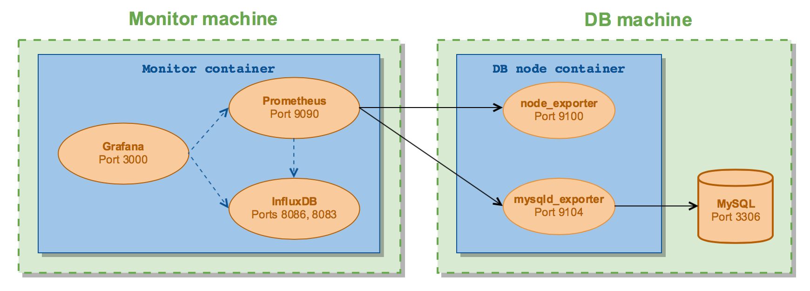

## Docker containers with Grafana, Prometheus and InfluxDB

There are 2 docker containers running the following software:

 1. Monitor container
   
    * [Prometheus](http://prometheus.io/) - monitoring system and time series database.
    * [Grafana](http://grafana.org/) - feature rich metrics dashboard and graph editor for Graphite, InfluxDB, OpenTSDB etc.
    * [InfluxDB](https://influxdata.com/time-series-platform/influxdb/) - time-series database with high availability and performance requirements.
    * [dashboards](https://github.com/percona/grafana-dashboards) - Grafana dashboards with Prometheus datasource for MySQL.

 2. DB node container
 
    * [node_exporter](https://github.com/prometheus/node_exporter) - Prometheus exporter for machine metrics.
    * [mysqld_exporter](https://github.com/prometheus/mysqld_exporter) - Prometheus exporter for MySQL server metrics.

On the diagram below you can see the connections between monitor and db node containers running on the corresponding host machines.

### Running monitor container

Get the source:

    git clone https://github.com/percona/grafana-prometheus-influx.docker
    cd grafana-prometheus-influx.docker

Build docker image:

    docker build -t monitor monitor/

Assuming `192.168.56.107` is IP address of the db machine aliased as `db1` which is going to be monitored.

Run container:

    docker run -d -p 3000:3000 -p 9090:9090 -p 8083:8083 -p 8086:8086 \
        -e DB_NODE_IP=192.168.56.107 -e DB_NODE_ALIAS=db1 --name prom monitor

Alternatively, with persistent storage:

    mkdir -p docker_shared/{prometheus,grafana,influxdb}
    chcon -Rt svirt_sandbox_file_t docker_shared  # if running selinux
    
    docker run -d -p 3000:3000 -p 9090:9090 -p 8083:8083 -p 8086:8086 --name prom \
        -v $PWD/docker_shared/prometheus:/opt/prometheus/data \
        -v $PWD/docker_shared/grafana:/var/lib/grafana \
        -v $PWD/docker_shared/influxdb:/var/lib/influxdb \
        -e DB_NODE_IP=192.168.56.107 -e DB_NODE_ALIAS=db1 --name prom monitor

Now you can access the tools (with no data yet):

 * Prometheus `http://<monitor_machine>:9090`
 * Grafana `http://<monitor_machine>:3000` (admin/admin)
 * InfluxDB `http://<monitor_machine>:8083`

### Running DB node container

Create MySQL user on the db machine for access by mysqld_exporter:

    mysql> GRANT REPLICATION CLIENT, PROCESS ON *.* TO 'prom'@'localhost' identified by 'abc123';
    mysql> GRANT SELECT ON performance_schema.* TO 'prom'@'localhost';

Build docker image:

    docker build -t dbnode dbnode/

Run container:

    docker run -d -p 9100:9100 -p 9104:9104 --net="host" \
        -e DATA_SOURCE_NAME="prom:abc123@(localhost:3306)/" --name exp dbnode
